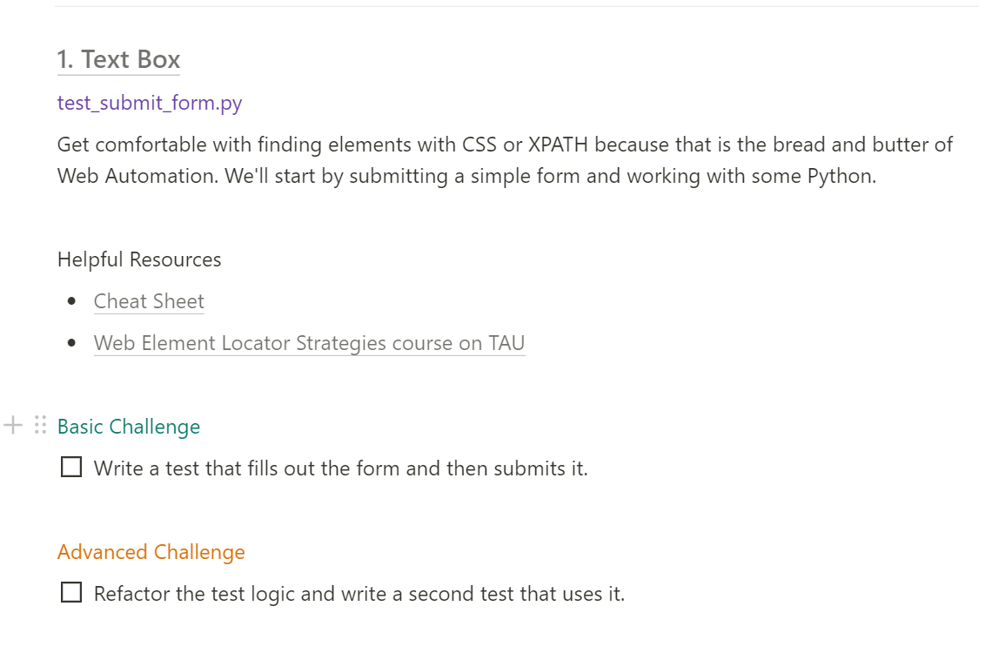
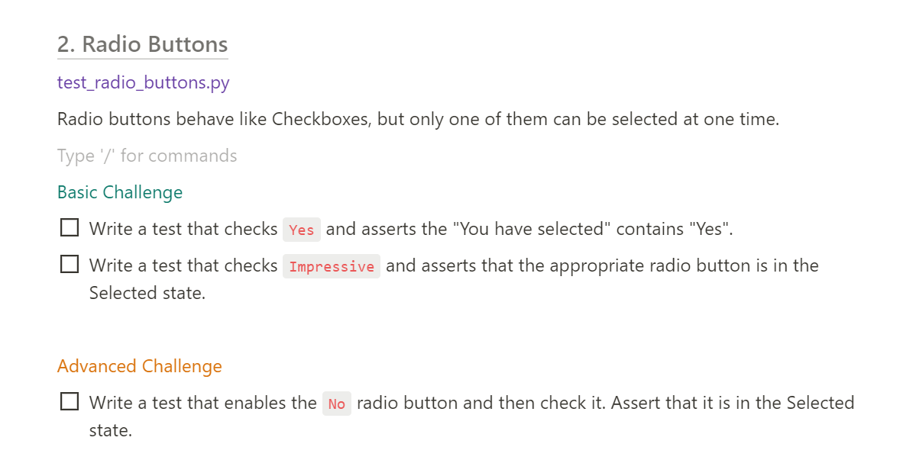
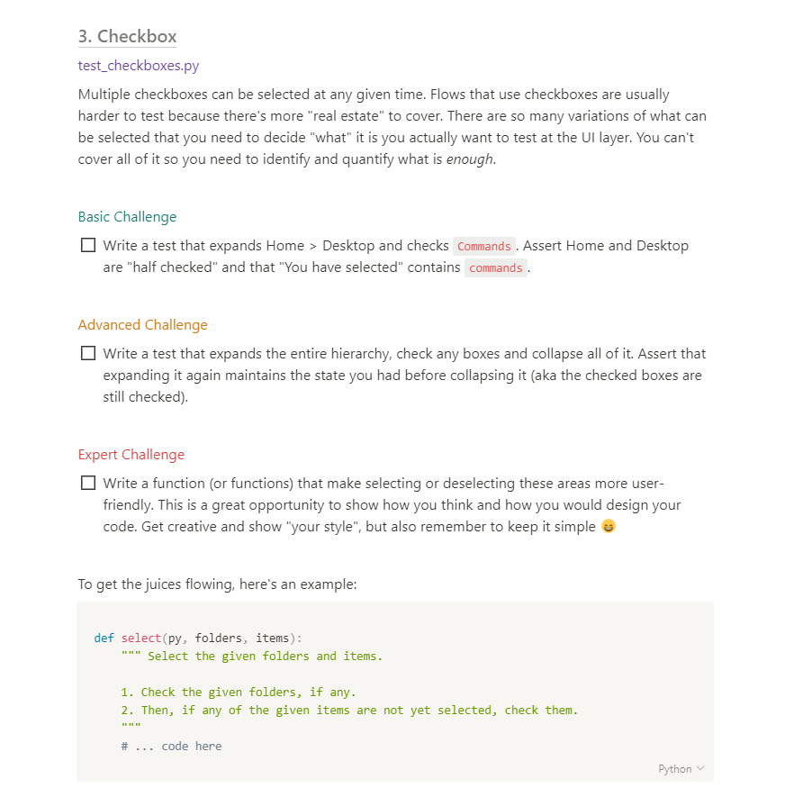

# Web Automation Demo

- Carlos Kidman invited his students at Autobots to create a portfolio with various web automation examples based on a post from Angie Jones
  - [10-portfolio-projects](https://techbeacon.com/app-dev-testing/10-portfolio-projects-aspiring-automation-engineers)
  - [Autobots](https://www.qap.dev/autobots)
> The challenges are completed in class as a group, solo, and homework

# Current Challenges
> website we tested against: https://demoqa.com
- **Elements**
  - [001 Text Boxes](#001-text-boxes)
  - [002 Radio Buttons](#002-radio-buttons)
  - [003 Check Boxes](#003-check-boxes)
  - [004 Dynamic Properties](#004-dynamic-properties)

# Challenge Description Images

## 001 Text Boxes

## 002 Radio Buttons

## 003 Check Boxes

## 004 Dynamic Properties

